# How to install microsoft office "FOR FREE"

Following this document you will be able to install a whole Microsoft Office package from 2019 to later of any version. It basically is done by downloading a tool called "officedeploymenttool" and followed by downloading and runnng a .xml file through command prompt.

The best thing is you can choose any version between professional and standard. For students professional version is recommended. You can also choose which microsoft service you want to keep and which you don't want to install.

**N.B: You must need an active internet connection to execute all the instructions. It only works for windows.**

### Here is a step by step process to install and activate MS Office:

**Step 1:** Create a folder anywhere in your computer. Remember, the downloaded files here will be of great help if you need to reinstall the office anytime later and in that case you won't need an internet connection to install but to activate.

**Step 2:** Go to this [address](https://www.microsoft.com/en-us/download/details.aspx?id=49117) and download the office deployment tool in the created folder.
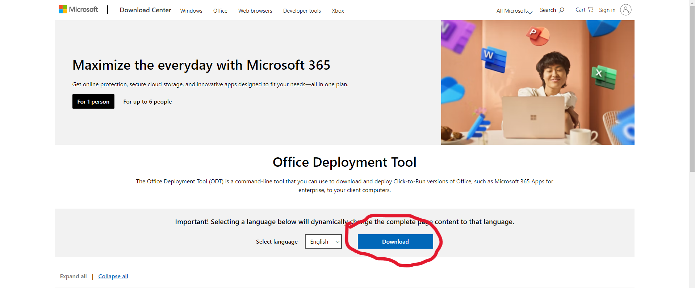

**Step 3:** Then go to this [address](https://config.office.com/deploymentsettings) to config and download the .xml file to the same folder.

--> First choose your desired version from here:
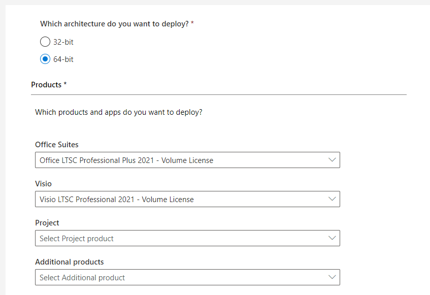

--> Then select which services you want to install from the same segment and click next.
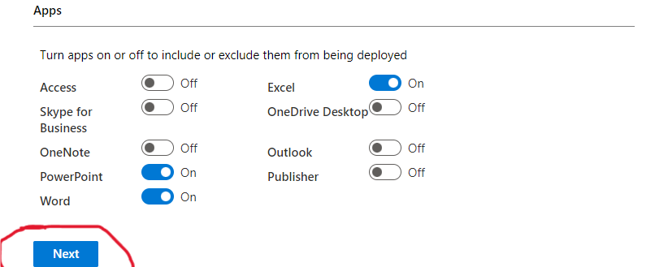

--> Lastly Select your language. There is nothing more to do with this section.
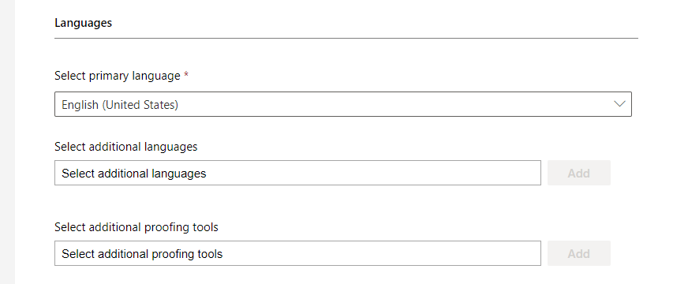

**Step 4:** Now click on "Export" on the top right corner to download the .xml file with a suitable name of your choice.

--> First choose the option that says "Office Open XML Formats" and click OK.
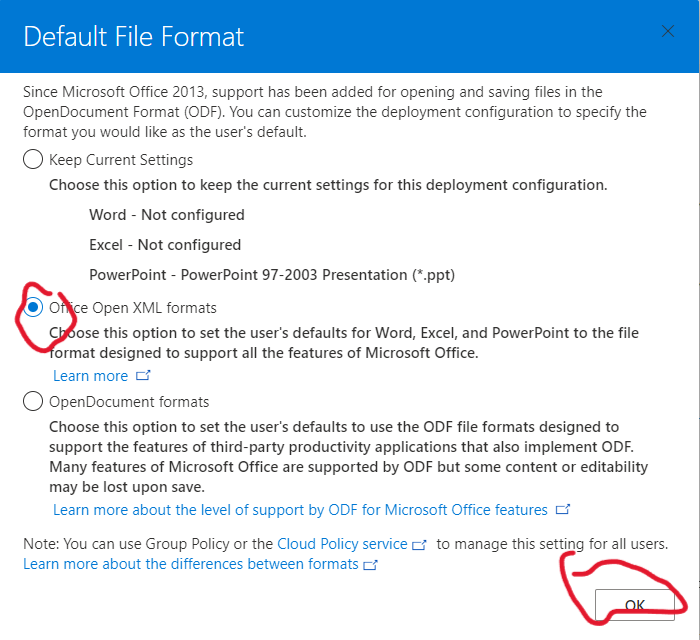

--> Then accept their aggreement, give a short name for the file; in this case I gave "cfg" and click export and download in the same folder.
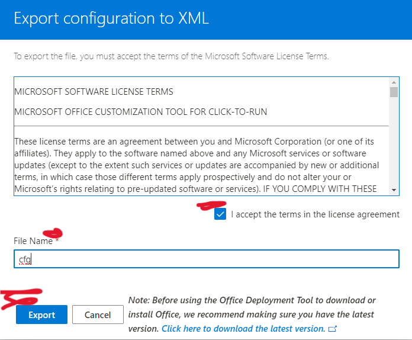

**Step 4:** Now go to the folder and run the office deployment tool and for convenience extract all the files into the same folder. You will get one `setup.exe` file and another xml file, but none of them is our concern.

**Step 5:** Now all the following instructions will be executed in the terminal. First of all open your folder in terminal. You can do this simply by typing "cmd" in the folder path and pressing enter key.

**Step 6:** In the terminal copy the command `setup.exe /download cfg.xml` and hit enter key. Your file name may be different. You will notice that a new folder will be created within that folder named "Office". Wait untill the download is completed. Your terminal will look sort of like this:
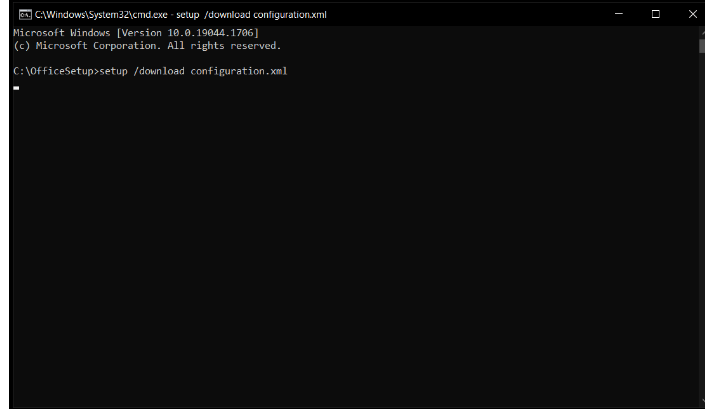

N.B: There will be no progress bar. Instead you will notice the blinking of cursor in terminal. When the download will be finished you will see the file path of your created folder will be shown.
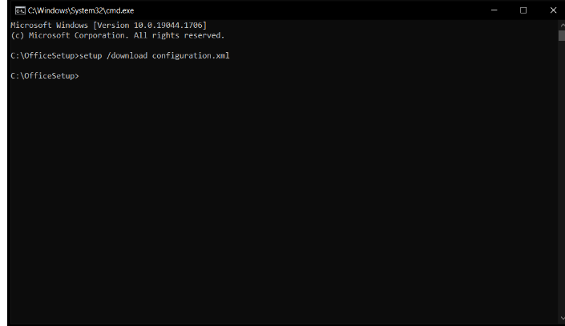

**Step 7:** After downloading, copy the command `setup.exe /configure cfg.xml` and hit enter again. This will trigger your main installation process about which you are may be familiar with.
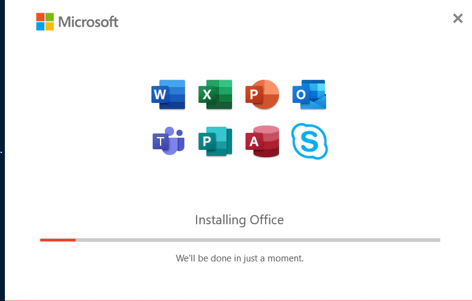

**Step 8:** After finishing installation, go to "C drive", then "Programm Files" (Not Programm Files (x86)) folder and find "Microsoft Office" ( not Microsoft Office 15). Then enter into the folder named "Office 16" and copy the path.

**Step 9:** Now open the command prompt as administrator and paste the copied path after typing `cd` followed by a space in the command prompt.
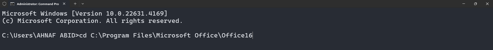

**Step 10:** It is the time for activation. First paste the following command:
```shell
cscript ospp.vbs /sethst:kms.03k.org
```
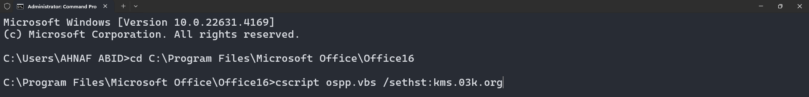
Wait till finshing of the process. Then paste the command provided below:
```shell
cscript ospp.vbs /act
```
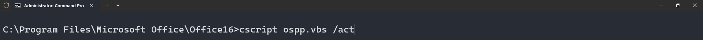
Again wait till finishing of the process.

**Congratulation!!!** You have just downloaded and activated MS Ofiice service without spending a single penny. Now it's time to work. You will get confirmation from the acount tab in any office service. Here is an example from MS Word.
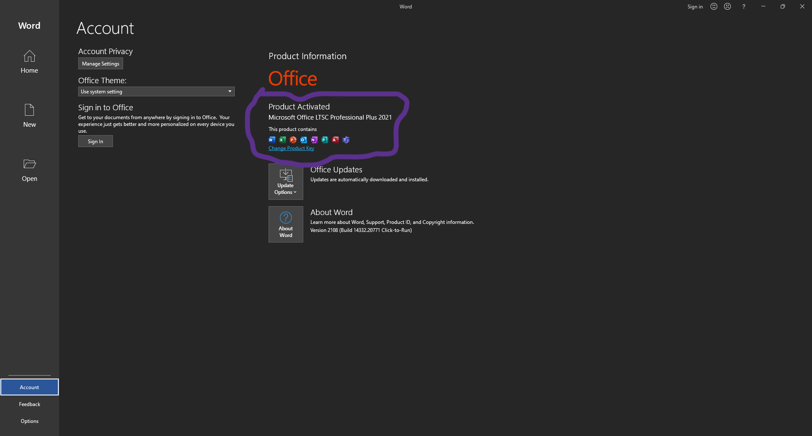